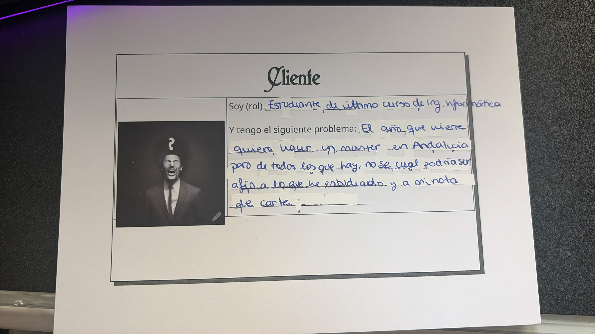

# EleccionMasterAndalucia
## Descripción

Soy estudiante de último curso de Ingeniería Informática y el año que viene me gustaría seguir formándome cursando un máster. 
Lo único que tengo decidido es que quiero hacerlo en alguna universidad de Andalucía, pero tengo que averiguar qué másteres son afines al grado que he estudiado y en cuáles de ellos tengo opciones reales de entrar. 
Me recomendaron ver las opciones en la web del Distrito Único Andaluz (DUA), pero me salen cientos de resultados y tardo mucho en ir viendo la ficha de cada máster y en calcular si es, o no, una opción viable para mí, ya que tengo que tener en cuenta la prioridad que tiene mi carrera con respecto a cada máster, la nota de corte de la última adjudicación y, además, al abrir varias fichas de algunos másteres que me han llamado la atención, me he dado cuenta de que la nota de corte no siempre es comparable a la que tengo en mi expediente, porque algunos másteres tienen en cuenta otros criterios, como, por ejemplo, si tengo algún certificado de idiomas o formación complementaria (como cursos u otras titulaciones).

## Fuentes de datos

Todos los datos necesarios proceden del portal del Distrito Único Andaluz (DUA). Las tres
consultas devuelven directamente el HTML con los datos en tablas (no se generan con JavaScript
en el navegador), por lo que se pueden procesar con código propio. Además, las tres comparten
el mismo identificador, el **código de máster** de 6 dígitos, que permite cruzar la
información de un mismo máster entre ellas.

- **Catálogo de másteres para mi titulación**: petición `POST` a
  https://www.juntadeandalucia.es/economiaconocimientoempresasyuniversidad/sguit/mo_catalogo.php
  con `titulpet=1175` (Grado en Ingeniería Informática; el código de cada titulación figura en
  el desplegable de titulaciones del buscador). Indica qué másteres admiten mi grado y con qué
  prioridad; las prioridades marcadas en rojo exigen un requisito adicional, que se detalla en
  la ficha del máster. Desde el navegador, se obtiene con el
  [buscador de másteres](https://www.juntadeandalucia.es/economiaconocimientoempresasyuniversidad/sguit/mo_catalogo_top.php)
  seleccionando la titulación. Ejemplo de fila: `492700 | GRANADA | INGENIERÍA INFORMÁTICA | ALTA`.
- **Notas de corte de la última adjudicación** (admisión al curso 2026/2027): petición `POST` a
  https://www.juntadeandalucia.es/economiaconocimientoempresasyuniversidad/sguit/convocatorias/master_consulta_adj/notas_corte_adj.php
  con `fase=220`. Indica la preferencia y la puntuación del último admitido en cada máster.
  Cuando aparece `** 0,01`, significa que accedieron todos los solicitantes de esa preferencia
  o superior. Abriendo la dirección directamente se obtiene la lista completa de la última
  adjudicación. Ejemplo de fila: `492700 | INGENIERÍA INFORMÁTICA | RESTO-5,00`.
- **Ficha de cada máster**: petición a
  `https://www.juntadeandalucia.es/economiaconocimientoempresasyuniversidad/sguit/mo_catalogo_ficha.php?c_peticion=<código de máster>`.
  Indica el baremo (qué criterios puntúan y con qué porcentaje) y los requisitos adicionales
  de admisión. Ejemplo: en la
  [ficha del máster 492700](https://www.juntadeandalucia.es/economiaconocimientoempresasyuniversidad/sguit/mo_catalogo_ficha.php?c_peticion=492700)
  el baremo es 100 % la nota media del expediente.

Copias descargadas el 25-09-2026: [catálogo](docs/fuentes-datos/catalogo_grado_1175_2026-09-25.html),
[notas de corte](docs/fuentes-datos/notas_corte_2026-09-25.html) y
[ficha del máster 492700](docs/fuentes-datos/ficha_492700_2026-09-25.html).

Los contenidos del portal de la Junta de Andalucía, del que forma parte el DUA, se pueden
reutilizar con licencia Creative Commons Reconocimiento 3.0 según su
[aviso legal](https://www.juntadeandalucia.es/informacion/legal.html). Información obtenida
del Portal de la Junta de Andalucía.

## Configuración del repositorio
[Configuración SSH y perfil](docs/configuracion/)

